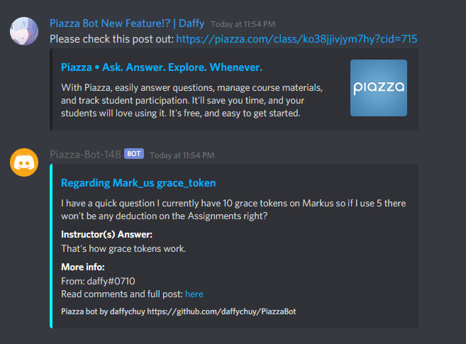

# PiazzaBot
Discord bot to embed Piazza posts in the designated server


## About

- PiazzaBot will give you a *embeded* preview of a Piazza post right on your server!
- Just enter in the link to the post, and PiazzaBot will take care of the rest! 
- The bot will auto search for the post that is associated with the class enrolled supplied via environment variable
- This bot also works for several linked post and will output them if valid

## Installation
To run PiazzaBot locally, do the following: 

1. First make a virtual environment in python using

```
python3 -m venv ./env
source ./env/bin/activate
pip3 install -r requirements.txt
```

2. Export your environment variables as such
Rename `.env.template` to `.env` and fill in all the fields defined in the file

3. Then run the program with `python3 ./connect.py`

To run PiazzaBot on services:

1. Set all your environment variables
2. Deploy!

**NOTE 1**: <span style="color:red">Your Piazza account **must** be enrolled in the class to get the embeded preview, or else it won't work.</span>

**Note 2**: You can directly deploy onto web services that supports the use of Procfile (aka heroku)

**Note 3**: To use your account for all the classes you have access to, simply put `CUR_CLASS="*"` as wildcard is supported


## Built With
- Python 3
- [Piazza-API](https://github.com/hfaran/piazza-api)
- [Discord.py](https://github.com/Rapptz/discord.py)

## Note
This repository is a fork of [piazza_bot](https://github.com/zzulanas/piazza_bot) by zzulanas but modified, improved and fixed errors for my personal use.

## License
This project is licensed under [MIT](LICENSE) - see the LICENSE file for details
